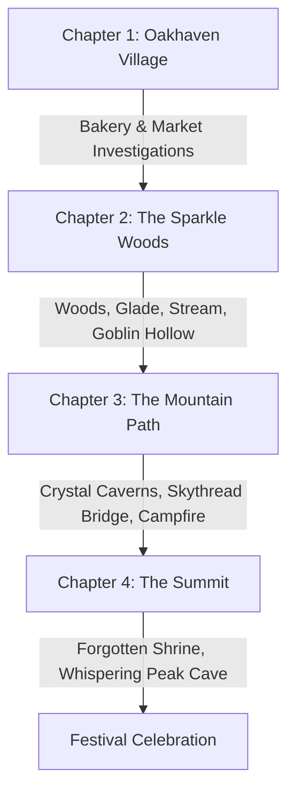

# 🐉 The Dragon of Whispering Peak: Complete DM Campaign Guide & Walkthrough
*A whimsical, heroic D&D adventure designed for young heroes (Ages 8–13).*

---

## 📖 Narrative Arc Overview

The campaign is structured as a 4-chapter, 12-scene emotional and heroic journey. The core theme is that **empathy, kindness, and cleverness are the ultimate superpowers**—even the most threatening "monsters" are often just misunderstood, lonely, or scared. 

### The Plot Points:
1. **The Mystery (Chapter 1):** The beloved annual Summer Festival is about to start in Oakhaven, but Mrs. Crumb's famous **Sun-Cakes** have been stolen! The heroes investigate the bakery and the market, uncovering a trail of golden crumbs and a mysterious blue, sparkly scale.
2. **The Journey (Chapter 2):** The trail leads into the enchanted **Sparkle Woods**. The heroes solve a riddle from a pompous owl, assist panicked glade pixies, cross a tricky crystal stream, and discover a camp of hungry, misunderstood goblins.
3. **The Ascent (Chapter 3):** Climbing the mountain, the heroes navigate musical crystal caves, comfort a lonely shadow ghost on a creaking rope bridge, and rest under the stars to connect a dragon constellation in the sky.
4. **The Climax & Resolution (Chapter 4):** After restoring an ancient stone shrine, the heroes reach the windy summit of **Whispering Peak**. They find **Glint the Dragon**—not a terrifying monster, but a clumsy, lonely creature who stole the cakes because he wanted to be included. Through friendship (or a non-lethal, lesson-teaching skirmish), the kids invite Glint back to the village, culminating in a festive joint-bakery celebration!

---

## 🛠️ Campaign-Wide Systems & VTT Console Guide

To run this adventure successfully on the Virtual Tabletop (VTT), keep this quick guide in mind:
*   **The "Bonk" Rule:** Characters never die. If a hero or monster reaches 0 HP, they are **"bonked"** (knocked out, tuckered out, or choose to surrender).
*   **Healing & Snacks:** The **Snack button** on the console heals a character for 2 HP and triggers a fun visual/audio snack event on the Player TV. Use it to reward good roleplay or help characters recover.
*   **Reactions:** Use the Quick Reactions (🎉, ❤️, 🌟, ❓, 💀, 🔥, 👏, 😂) generously. When a kid says something creative or kind, let the TV float emojis to show they did something cool.
*   **D20 Rule of Thumb:** If a kid wants to try something wild, let them! Have them roll a d20. A roll of **10 or higher** is generally a success.

---

# 🗺️ Scene-by-Scene Walkthrough (12 Scenes)

---

## 🍞 Chapter 1: Oakhaven Village

### Scene 1: `bakery` — Mrs. Crumb's Bakery 🧁
*The morning of the Summer Festival has arrived, but the oven is cold and the baker is in tears.*

#### 🎙️ The Narrative Setup
> **"The sun rises over the thatched roofs of Oakhaven, painting the sky in warm shades of orange and pink. Today is the Summer Festival, the happiest day of the year! You walk toward Mrs. Crumb’s bakery, expecting the mouth-watering scent of cinnamon and sugar. Instead, the chimney is silent. Inside, Mrs. Crumb is sitting on a spilled sack of flour, sobbing loudly into her apron. The beautiful glass display case—which should be stacked high with her legendary golden Sun-Cakes—is completely empty! Flour is dusted across the floor, a window pane is cracked open, and the whole kitchen is a giant, messy scramble. The Sun-Cakes are gone!"**

#### 🎛️ VTT Console Button Pushes
*   [ ] Select **Bakery** in the Scenes sidebar.
*   [ ] Set Audio Mood to **Calm** (Warm golden pads / cozy village morning).
*   [ ] Send Narration: `Mrs. Crumb's Sun-Cakes have been stolen! Find the clues!`
*   [ ] Click **Launch Puzzle** in the purple Puzzle Controls section to start the **Spotlight Search**.
*   [ ] Click the **Sun-Cakes Handout** button in the gallery to display the empty display box.
*   [ ] Drag the Spotlight on your DM panel to guide players. When they find a clue:
    *   *Scale:* Hit the **🌟 Reaction** and narrate the blue glitter.
    *   *Crumbs:* Hit the **❓ Reaction** and point toward the door.
    *   *Footprint:* Hit the **👏 Reaction** and describe the window.
*   [ ] Click **Dismiss Overlay** to close the handout when done.
*   [ ] Click **End Puzzle** once all three clues are uncovered.

#### 🎭 Roleplay Guide: Mrs. Crumb
*   **Voice/Mannerisms:** High-pitched, maternal, very dramatic. Wring your hands, wipe your eyes with a floury sleeve, and gasp frequently.
*   **Key Lines:**
    *   *"Oh, my beautiful Sun-Cakes! The festival starts in a few hours, and everyone is counting on me!"*
    *   *"Whoever did this was messy! There are crumbs leading right out the front door!"*
    *   *"Please, brave heroes—you’re the only ones who can track down whatever took them!"*

#### 🧩 Puzzle & Encounter Mechanics
*   **Spotlight Search:** The players suggest areas to search (e.g., "behind the oven," "by the window," "on the floor"). The DM drags the spotlight to reveal:
    1.  **Blue Sparkly Scale** (behind the oven) — A hint that a dragon or lizard-like creature was here.
    2.  **Golden Crumb Trail** (leading out the door) — Shows the direction the thief fled.
    3.  **Footprint** (near the window) — Shows where the intruder broke in.

#### 📜 Side Quests & Rewards
*   **Main Quest:** "Find the Bakery Clue" (Active) -> Resolved when all 3 clues are found.
*   **Reward:** **Golden Crumb** (Quest Item - shiny and warm to the touch).

#### ⏱️ Pacing Tips
*   *If kids are hyper:* Keep the search fast. Directly spotlight the scale and the crumb trail to get them moving out of the bakery quickly.
*   *If kids are quiet:* Let them describe their characters' reactions to the messy kitchen. Ask Lily the Silent where her rogue instincts tell her to look first.

---

### Scene 2: `market` — Oakhaven Market Square 🏪
*The festival grounds are bustling, but a merchant's ruined cart points to a larger plot.*

#### 🎙️ The Narrative Setup
> **"You step out into the bustling Oakhaven Market Square. Timber-framed shops are draped in colorful flags, and the smell of spiced cider fills the air. But near the stone fountain, there is chaos. A large delivery cart is tilted on its side, its wooden wheels spinning uselessly in the air. Jars of honey and bags of flour are scattered across the cobblestones. Standing beside it is Barnaby Barrelsworth, a round-bellied merchant with a mustache as wide as a barrel. He is waving his arms wildly, shouting to anyone who will listen!"**

#### 🎛️ VTT Console Button Pushes
*   [ ] Select **Market** in the Scenes sidebar.
*   [ ] Set Audio Mood to **Calm** (Bustling festival ambient score).
*   [ ] Click **Launch Puzzle** for the **Ingredient Hunt**.
*   [ ] Guide players as they drag ingredients into the correct recipe bowls on their screen.
*   [ ] Click **End Puzzle** once the recipes are completed.
*   [ ] Share **Mrs. Crumb's Secret Recipe** handout when they speak with her.
*   [ ] Click **Dismiss Overlay** to close the handout.

#### 🎭 Roleplay Guide: Barnaby & Maisie
*   **Barnaby Barrelsworth:** Boisterous, jolly, speaks with a booming voice and strokes his giant mustache constantly.
    *   *Key Line:* *"By my brass buttons! A shadow zapped right through my stall last night, knocked over my cart, and stole my finest spices! If you're going into the woods, could you keep an eye out for my lost parcel?"*
*   **Little Maisie:** A small village child crying near the fountain.
    *   *Key Line:* *"My kitty Whiskers got scared by the big crash and hid! Can you please help me find him?"*

#### 🧩 Puzzle & Encounter Mechanics
*   **Ingredient Hunt:** Sort the scattered ingredients:
    *   *Moonberry* + *Starflour* = **Moon-Bread** (drag to the silver bowl)
    *   *Dragon Pepper* + *Honey Dew* = **Sun-Cake** (drag to the golden bowl)
*   **Skill Check (Find Whiskers):** A player must succeed on a **DC 10 Perception check** to spot the orange kitten hiding behind a stack of cider barrels.

#### 📜 Side Quests & Rewards
*   **Side Quest 1:** "Deliver the Merchant's Parcel" -> Started. (Barnaby asks the heroes to recover and deliver a lost package. It will be found in the `goblin_camp`).
*   **Side Quest 2:** "Find Whiskers the Kitten" -> Can be resolved here.
    *   *Reward:* **Lucky Cat Charm** (A little wooden charm. Grants the finder +1 to a single Dexterity saving throw).
*   **Side Quest 3:** "Mrs. Crumb's Secret Recipe" -> Started.
    *   *Details:* Mrs. Crumb whispers that she needs three rare ingredients to bake a legendary cake: **Moonberries** (found in `glade`), **Cave Crystal** (found in `caves`), and **Star Honey** (found in `camp`).
    *   *Reward:* **Golden Rolling Pin** (earned in Scene 12).

#### ⏱️ Pacing Tips
*   *If kids are hyper:* Skip the kitten quest. Have Barnaby point them directly toward the forest edge where the thief fled.
*   *If kids are quiet:* Let them roll the dice to search for the kitten. Kids love animals; finding Whiskers is a great way to make them feel successful early on.

---

## 🌲 Chapter 2: The Sparkle Woods

### Scene 3: `woods` — The Sparkle Woods 🌳
*The forest is magical, but a pompous scholar and a protective mother wolf block the path.*

#### 🎙️ The Narrative Setup
> **"You cross the threshold into the Sparkle Woods. Instantly, the noises of the village fade, replaced by a quiet, magical hum. The leaves overhead glow with a soft green light, and tiny silver mushrooms light the path like runway lanterns. But suddenly, a loud, pompous throat-clear echoes from above—ahem! AHEM! Perched on a low, mossy branch is a plump owl wearing a tiny pair of round spectacles balanced on his beak. He rustles his feathers and glares at you. Further down the path, you hear a low growl. A silver-furred wolf stands protectively in front of a hollow log, her yellow eyes glowing in the shadows."**

#### 🎛️ VTT Console Button Pushes
*   [ ] Select **Woods** in the Scenes sidebar.
*   [ ] Set Audio Mood to **Calm** (Ethereal emerald shimmer).
*   [ ] Send Narration: `Hoot the Riddle-Owl blocks the path! Answer his riddle to pass.`
*   [ ] Click **Launch Puzzle** for **Hoot's Riddle**.
*   [ ] If the players are stuck, click **Reveal Hint** on the console.
*   [ ] Click **Answer** when they guess correctly ("A River"), then click **End Puzzle**.
*   [ ] Select **Tense** or **Combat** mood if they provoke Silverfang or Hoot.
*   [ ] If they offer food to Silverfang, click the **Snack** button and hit the **❤️ Reaction**.

#### 🎭 Roleplay Guide: Hoot the Riddle-Owl
*   **Voice/Mannerisms:** Sounds like a snobby professor. Use big words, adjust imaginary glasses, and look down your nose at the players.
*   **Key Lines:**
    *   *"Hoo-goes there? One does not simply trample through my majestic forest without demonstrating adequate intellectual capacity!"*
    *   *"Answer my riddle, or prepare to feel the buffet of my scholarly wings!"*

#### 🧩 Puzzle & Encounter Mechanics
*   **Hoot's Riddle:**
    > *"I have a heart that doesn't beat, I have a bed but never sleep, I can run but have no legs. What am I?"*
    *   *Solution:* **A River** 🏞️
*   **Silverfang Encounter:** Silverfang (14 HP) is guarding her pups in the log. 
    *   *Friendly Solution:* If a hero uses their action to offer a Sun-Cake, some rations, or succeeds on a **DC 10 Animal Handling check**, she becomes peaceful.
    *   *Combat:* If attacked, she defends her pups. She will surrender and run into the brush if reduced to 5 HP.

#### 📜 Side Quests & Rewards
*   **Main Quest:** "Solve Hoot's Riddle" -> Resolved when they answer the riddle.
    *   *Reward:* **Owl's Blessing** (Advantage on their next Wisdom-based check).
*   **Side Quest:** "Tame Silverfang" -> Resolved if they feed or calm her.
    *   *Reward:* **Wolf Fang Necklace** (Grants +1 to Animal Handling checks) and Silverfang will follow them as a helpful guide.

#### ⏱️ Pacing Tips
*   *If kids are hyper:* Give them the riddle hint early. If they want to fight, run a quick round of combat with Silverfang so Thorne can swing his sword.
*   *If kids are quiet:* Give them clues about the riddle by describing the sound of rushing water nearby. Encourage them to talk to the owl.

---

### Scene 4: `glade` — The Fairy Glade 🧚
*Panicked pixies and a grumpy mushroom keeper reside in a vibrant wildflower clearing.*

#### 🎙️ The Narrative Setup
> **"You push through a curtain of hanging vines and step into the Fairy Glade. Sunbeams pour through the leafy roof, illuminating a carpet of glowing pink and purple wildflowers. But instead of peace, the glade is in utter chaos! Dozens of tiny lights are zipping around like runaway fireworks. A beautiful miniature pixie with shimmering wings—Twinkle, the Pixie Queen—flies right up to your nose. 'Oh, thank goodness!' she squeaks. 'Our enchanted firefly lanterns escaped! They're zipping everywhere! Please help us catch them before they lose their glow!'"**

#### 🎛️ VTT Console Button Pushes
*   [ ] Select **Glade** in the Scenes sidebar.
*   [ ] Set Audio Mood to **Calm** (Ethereal forest hum).
*   [ ] Click **Launch Puzzle** for **Firefly Catch**.
*   [ ] Press the **Release Firefly** button on your console to spawn fireflies on the player screen. Tell the kids to tap/click them!
*   [ ] Hit the **🌟 Reaction** every time they catch one.
*   [ ] Click **End Puzzle** once all 6 fireflies are caught.

#### 🎭 Roleplay Guide: Twinkle & Sporecap
*   **Twinkle:** Extremely energetic, giggly, speaks at a mile-a-minute. Loves harmless pranks.
    *   *Key Line:* *"Wheee! You're fast for giants! Oh, look, rogue—your hair is bright purple now! Happy festival!"*
*   **Sporecap the Sprite:** A grumpy little mushroom creature sitting on a stump, arms tightly crossed.
    *   *Key Line:* *"Hmph! Watch your boots, giants! Don't step on my moss! One squish and you'll face the wrath of my Spore Puff!"*

#### 🧩 Puzzle & Encounter Mechanics
*   **Firefly Catch:** A mini-game where the DM spawns glowing fireflies and the players click them before they disappear.
*   **Sporecap's Garden:** Sporecap (10 HP) guards the shortcut. If players help him tend his garden (succeeding on a **DC 10 Nature check** or through fun roleplay where they water the mushrooms), he reveals a secret path.

#### 📜 Side Quests & Rewards
*   **Side Quest 1:** "Catch the Escaped Fireflies" -> Resolved.
    *   *Reward:* **Fairy Lantern** (A glowing jar that never goes out. It reveals hidden tracks on the ground).
*   **Side Quest 2:** "Follow the Mushroom Trail" -> Resolved if they help Sporecap.
    *   *Reward:* **Woodland Map** (+1 to Survival checks in the woods).
*   **Mrs. Crumb's Secret Recipe:** Players can collect **Moonberries** from the bushes in this scene.

#### ⏱️ Pacing Tips
*   *If kids are hyper:* The click-based firefly game is perfect for high energy. Let them click rapidly, then immediately describe Sporecap pointing them to the stream.
*   *If kids are quiet:* Describe Twinkle playing a funny prank on one of them (e.g., making Valerius's shield glow in rainbow colors) to get them laughing and talking.

---

### Scene 5: `stream` — The Glimmer Stream 💧
*A silver river must be crossed, but the stepping stones are a trap of comedic splashes.*

#### 🎙️ The Narrative Setup
> **"The sound of rushing water grows louder as you reach the Glimmer Stream. The water isn't blue—it looks like liquid silver, flowing smoothly over glittering pebbles. Flat, round stepping stones stretch across the stream to the other side. But as you look closer, you notice a fat, bright green bullfrog wearing a tiny gold paper crown sitting on the middle stone. He stares at you, blinks slowly, and lets out a very loud, judgmental RIBBIT. The water is deep, and the stones look slick. You'll have to choose your steps carefully!"**

#### 🎛️ VTT Console Button Pushes
*   [ ] Select **Stream** in the Scenes sidebar.
*   [ ] Set Audio Mood to **Calm** (Lush water sounds and light crystal bells).
*   [ ] Click **Launch Puzzle** for **Stepping Stones**.
*   [ ] Watch the safe path layout on your DM screen. 
*   [ ] As players choose left, middle, or right stones, click the buttons on your console.
    *   *If Shaky:* Hit the **😂 Reaction** and describe a funny splash.
    *   *If Safe:* Hit the **👏 Reaction** and describe a graceful balance.
*   [ ] Click **End Puzzle** once they cross the stream.

#### 🎭 Roleplay Guide: The Frog King
*   **Voice/Mannerisms:** Puff out your cheeks, blink slowly, and make loud, deep croaks. Translate his ribbits with comedic exaggeration.
*   **Key Lines:**
    *   *"Ribbit! (Translate: You call that footwork? Pathetic!)*
    *   *"Ribbit-croak! (Translate: Bring me a shiny fly, or prepare to get wet!)*

#### 🧩 Puzzle & Encounter Mechanics
*   **Stepping Stones:** The stream consists of **4 rows of 3 stones**. The DM console shows which stone in each row is safe.
    *   *Splash Effect:* Stepping on an incorrect stone causes it to wobble. The hero slips and lands in the silver water with a loud **SPLOOSH!** They are washed back to the starting bank (no damage, just funny wetness).
    *   *Hint:* Players can spot the safe stones by succeeding on a **DC 10 Perception check** (the safe stones have tiny glowing blue runes).

#### 📜 Side Quests & Rewards
*   **Main Quest:** "Cross the Glimmer Stream" -> Resolved.
    *   *Reward:* **Hero's Badge** (Grants the wearer +1 to saving throws against being knocked prone).

#### ⏱️ Pacing Tips
*   *If kids are hyper:* Make the splashes as dramatic and funny as possible. Let the frog hop onto the splashed hero's head for a ride.
*   *If kids are quiet:* Let them help each other. Have the Rogue use their rope to pull a splashed friend back to safety, bypassing a row.

---

### Scene 6: `goblin_camp` — Goblin Hollow ⛺
*A camp of nervous goblins holds a key item—and represents a major moral crossroads.*

#### 🎙️ The Narrative Setup
> **"You creep through the thick bushes and look down into Goblin Hollow. Instead of a scary fortress, you see a collection of messy patchwork tents made of old blankets and sticks. A campfire burns in the center, and a terrible smell of burnt cabbage stew wafts up. Sitting on a log near the fire is Chief Grumbletooth—a chubby goblin wearing a rusty crown. He is holding a half-eaten Sun-Cake, looking incredibly guilty, and stuffing frosting into his face. A tiny goblin scout named Snick is hiding behind a barrel nearby, shaking with fear as he peeks at you!"**

#### 🎛️ VTT Console Button Pushes
*   [ ] Select **Goblin Camp** in the Scenes sidebar.
*   [ ] Set Audio Mood to **Tense** (Mischievous, sneaky minor key).
*   [ ] If the players decide to sneak, click **Launch Puzzle** for the **Sneak Path**.
*   [ ] If they talk to the goblins, crossfade Audio Mood to **Calm** and click the **❤️ Reaction**.
*   [ ] If they fight, switch Audio Mood to **Combat** and add **Grumbletooth** (25 HP) and **Snick** (8 HP) to the Initiative Tracker.
*   [ ] Share the **Merchant's Parcel** handout when they recover it.
*   [ ] Click **Dismiss Overlay** to close the handout.

#### 🎭 Roleplay Guide: Grumbletooth & Snick
*   **Chief Grumbletooth:** Trying to sound tough but easily startled. Speaks in a raspy, defensive voice.
    *   *Key Line:* *"We goblins are very fierce! Fear our... cookies! Wait, no! Don't take the cake! It's mine! Well, I found it. In a cart. Okay, I stole it, but I was so hungry!"*
*   **Snick:** High-pitched, twitchy, stutters.
    *   *Key Line:* *"Chief! Chief! They have big metal swords! They are gonna turn us into green soup! Or maybe they want to share their lunch?"*

#### 🧩 Puzzle & Encounter Mechanics
*   **Sneak Path (Optional Puzzle):** 4 checkpoints. Players choose Left, Middle, or Right routes. Choosing the stealthiest path bypasses the goblins without a fight.
*   **Diplomacy vs. Combat (Critical Choice):** 
    *   *Combat:* Grumbletooth (25 HP) and Snick (8 HP) fight back. If Grumbletooth is reduced to 10 HP, he drops his wooden sword and cries, surrendering immediately.
    *   *Diplomacy:* If the kids talk to Grumbletooth, offer him rations, or make a **DC 10 Persuasion check**, he becomes friendly and explains he only stole food because the goblins were starving.

#### 📜 Side Quests & Rewards
*   **Side Quest 1:** "Negotiate the Goblin Truce" -> Resolved if they choose peace.
    *   *Reward:* **Peace Treaty Scroll** (Written in crayon; guarantees safe passage through all goblin lands. Grumbletooth can become a funny companion).
*   **Side Quest 2:** "Deliver the Merchant's Parcel" -> Resolved. (The package Barnaby lost is sitting in their camp).
    *   *Reward:* **Pouch of Silver** (Each hero receives 10 silver pieces).

#### ⏱️ Pacing Tips
*   *If kids are hyper:* Let them run a quick combat. Goblins are great for funny combat descriptions (e.g., throwing bowls of cabbage stew at Thorne).
*   *If kids are quiet:* Lean heavily into Grumbletooth's guilt. Have him offer them a crumb of their own Sun-Cake as an apology to spark a conversation.

---

## ⛰️ Chapter 3: The Mountain Path

### Scene 7: `caves` — The Crystal Caverns 💎
*The caves hum with beautiful music, but a failed song will wake the bats.*

#### 🎙️ The Narrative Setup
> **"You leave the woods behind and enter the cool, dark mouth of the Crystal Caverns. As you step inside, your breath is taken away. The cavern walls are covered in thousands of glowing crystals—blue, pink, gold, and green. They hum with a soft, musical vibration. In the center of the cave, four giant crystals stand like silent pillars. A gentle breeze blows through the cavern, causing them to ring out with beautiful tones. But as you walk forward, you hear a high-pitched squeaking from the ceiling. A swarm of crystal-winged bats is sleeping overhead, sensitive to any sudden noise!"**

#### 🎛️ VTT Console Button Pushes
*   [ ] Select **Caves** in the Scenes sidebar.
*   [ ] Set Audio Mood to **Tense** (Crystalline echoes).
*   [ ] Click **Launch Puzzle** for **Crystal Melody**.
*   [ ] Play the crystal notes on the console (Simon Says). Let the kids repeat the pattern on their screens.
*   [ ] If they complete the 5-note pattern, click **End Puzzle** and hit the **🎉 Reaction**.
*   [ ] If they fail twice, add **Crystal Bat Swarm** (18 HP) to the Initiative Tracker and switch Audio Mood to **Combat**.

#### 🎭 Roleplay Guide: Old Finnegan
*   **Voice/Mannerisms:** Doddering, extremely cheerful, a bit confused. Strokes a long white beard and talks to mushrooms.
*   **Key Lines:**
    *   *"Oh! Hello there! Are you lost too? Splendid! I came in here to find a shiny crystal... about three weeks ago. Or was it three years? Either way, Gerald the mushroom here is a great listener!"*

#### 🧩 Puzzle & Encounter Mechanics
*   **Crystal Melody (Simon Says):** The DM plays a sequence of colored crystals. Players must repeat the sequence. The game progresses up to a 5-note sequence.
    *   *If Audio fails:* Voice-act the notes! *"Ding... Dong... Bell... Ring!"*
*   **Bat Swarm Trigger:** If the players fail the melody, the bats (18 HP) awaken and attack. They are frightened by bright light (like the Fairy Lantern).

#### 📜 Side Quests & Rewards
*   **Side Quest 1:** "Learn the Crystal Melody" -> Resolved.
    *   *Reward:* **Singing Crystal** (A small hand-sized crystal that plays a soothing tune, giving Advantage on Animal Handling checks).
*   **Side Quest 2:** "Find the Lost Traveler" -> Resolved if they rescue Finnegan and guide him to the entrance.
    *   *Reward:* **Traveler's Compass** (+1 to all future navigation/Survival checks).
*   **Mrs. Crumb's Secret Recipe:** Players can harvest a glowing **Cave Crystal** here.

#### ⏱️ Pacing Tips
*   *If kids are hyper:* The Simon Says game is very engaging. Keep the rounds fast.
*   *If kids are quiet:* Have Finnegan offer them funny, bad advice on how to cross the cave to get them laughing.

---

### Scene 8: `bridge` — The Skythread Bridge 🌉
*An ancient bridge sways over a foggy void, guarded by a sad, lonely spirit.*

#### 🎙️ The Narrative Setup
> **"You emerge onto a high mountain cliff. The wind howls, and stretching across a deep, foggy chasm is the Skythread Bridge. It is made of old, frayed ropes and weathered wooden planks that creak and sway in the wind. Several planks are completely missing, showing nothing but swirling white mist below. As you step closer, the mist in front of the bridge begins to spin. It forms into a translucent, glowing figure with large, sad eyes—a Shadow Wisp. It floats silently, blocking the way, letting out a low, sighing moan that sounds like the wind."**

#### 🎛️ VTT Console Button Pushes
*   [ ] Select **Bridge** in the Scenes sidebar.
*   [ ] Set Audio Mood to **Tense** (Airy exposed wind / lonely tones).
*   [ ] Add **Shadow Wisp** (15 HP) to the Initiative Tracker.
*   [ ] If players tell a story to comfort the wisp, switch Audio Mood to **Calm**, click **❤️ Reaction**, and remove the wisp.
*   [ ] If they fight, switch Audio Mood to **Combat** and roll attacks.
*   [ ] Use the **Skill Check Roller** when they repair the bridge.

#### 🎭 Roleplay Guide: The Shadow Wisp
*   **Voice/Mannerisms:** Do not speak in words. Make soft, sighing wind sounds (*"Ooo-ssshhh..."*). Reach out with pale, glowing hands in a pleading, non-aggressive gesture.
*   **Key Lines:** None (communicate through gestures and sad expressions).

#### 🧩 Puzzle & Encounter Mechanics
*   **No Puzzle Screen:** This is a pure roleplay and skill-check encounter.
*   **Bridge Repair:** The bridge has 3 broken sections. A hero must succeed on a **DC 10 Athletics check** to repair a plank. Three successful checks are needed for the party to cross safely. (A failure just means a foot slips, causing a scary but harmless dangle).
*   **Calming the Wisp:** The Wisp (15 HP) is sad and lonely. 
    *   *Friendly Solution:* If a player tells a story, plays music (using the Singing Crystal), or uses a warm holy ability (like Valerius's Lay on Hands), the Wisp is comforted. It smiles and melts peacefully into the mist.

#### 📜 Side Quests & Rewards
*   **Side Quest:** "Repair the Skythread Bridge" -> Resolved after 3 successful repairs.
    *   *Reward:* **Builder's Badge** (Grants a permanent +1 to Strength saving throws).

#### ⏱️ Pacing Tips
*   *If kids are hyper:* Focus on the danger of the creaking bridge. Describe the wind gusting and the ropes groaning to capture their attention.
*   *If kids are quiet:* Ask Valerius the Paladin how his character feels seeing a sad ghost. Encourage him to use his comforting paladin powers.

---

### Scene 9: `camp` — Moonlit Campfire 🏕️
*A cozy rest under a sky of stars, where the heroes heal and connect the dots.*

#### 🎙️ The Narrative Setup
> **"You find a sheltered clearing nestled against the mountain rock. The wind dies down, and looking up, you see a blanket of a million twinkling stars stretching across the clear night sky. An ancient stone fire ring sits in the center. As you sit down to rest your tired feet, golden-winged bees drift lazily through the air, trailing drops of warm, glowing honey. This place is warm, safe, and peaceful. It is time to build a fire, share a snack, and look up at the stars."**

#### 🎛️ VTT Console Button Pushes
*   [ ] Select **Camp** in the Scenes sidebar.
*   [ ] Set Audio Mood to **Calm** (Cozy nighttime campfire lullaby).
*   [ ] Use the **HP Controls** to set all players to **Full HP** (rest finished).
*   [ ] Click **Launch Puzzle** for **Star Connect**.
*   [ ] Guide players to click the 7 stars in numerical order to draw the dragon constellation on the TV.
*   [ ] Click **End Puzzle** once the constellation is complete.
*   [ ] Hit the **🌟 Reaction** to light up the sky.

#### 🎭 Roleplay Guide: Grumbletooth (if present)
*   **Chief Grumbletooth:** Sits close to the fire, eating a toasted marshmallow or ration.
    *   *Key Line:* *"Goblin campfire stories are best. Once, goblin found a shiny rock. Then bird took it. The end. I cry every time."*

#### 🧩 Puzzle & Encounter Mechanics
*   **Star Connect:** A simple connect-the-dots puzzle. Players click the 7 stars on screen to draw a glowing dragon constellation.
*   **Campfire Rest:** All players are fully healed. This is a safe zone; no combat can happen here.

#### 📜 Side Quests & Rewards
*   **Side Quest 1:** "Share a Hero's Tale" -> Resolved if each player shares one thing their character is thinking about or a memory.
    *   *Reward:* **Story Token** (Can be turned in to reroll any single d20 roll).
*   **Side Quest 2:** "Name a Constellation" -> Resolved after completing the star puzzle.
    *   *Reward:* **Star Map** (Allows the user to cast the *Light* cantrip once per day).
*   **Mrs. Crumb's Secret Recipe:** Players can safely collect **Star Honey** from the golden bees.

#### ⏱️ Pacing Tips
*   *If kids are hyper:* Do the star connect puzzle immediately, heal their HP, and move on.
*   *If kids are quiet:* Use this time for a real-life snack break. Ask open-ended questions: *"Lily, what is your character's favorite food to toast over the fire?"*

---

## 🏔️ Chapter 4: The Summit

### Scene 10: `ruins` — The Forgotten Shrine 🏛️
*Ancient stone runes must be matched to pacify a towering stone guardian.*

#### 🎙️ The Narrative Setup
> **"Moss-covered pillars rise like giant stone fingers into the cold mountain air. At the center of the ruins sits a cracked stone altar, covered in glowing, ancient runes. But as you step onto the paved ground, a deep rumble shakes the earth. The massive stone statue at the head of the altar opens its eyes, which ignite with brilliant blue fire! Stone grinds against stone as it steps off its pedestal with a thunderous BOOM. It looks down at you and speaks in a voice like a rockslide: 'WHO... DARES... ENTER... THE... SHRINE?'"**

#### 🎛️ VTT Console Button Pushes
*   [ ] Select **Ruins** in the Scenes sidebar.
*   [ ] Set Audio Mood to **Tense** (Ancient mysterious tones).
*   [ ] Click **Launch Puzzle** for **Rune Match**.
*   [ ] Add **Stone Guardian** (35 HP) to the Initiative Tracker.
*   [ ] *If they solve the puzzle:* Crossfade Audio Mood to **Calm**, click **❤️ Reaction**, and remove the Guardian from initiative.
*   [ ] *If they fight:* Set Audio Mood to **Combat** and run the encounter.
*   [ ] Click **End Puzzle** when finished.

#### 🎭 Roleplay Guide: The Stone Guardian
*   **Voice/Mannerisms:** Deep, slow, robotic. Speak with long pauses between words.
    *   *Key Line:* *"RESTORE... THE... RUNES... AND... PROVE... YOUR... PURPOSE... OR... BE... CAST... OUT!"*
    *   *If pacified:* *"YOU... ARE... WORTHY. TAKE... THE... BLESSING... OF... THE... ANCIENTS."*

#### 🧩 Puzzle & Encounter Mechanics
*   **Rune Match:** A memory matching game with 4 pairs of face-down runes. 
*   **The Guardian's Test:**
    *   *Puzzle Route:* If the players complete the Rune Match puzzle *before* attacking, the Stone Guardian steps back onto its pedestal and becomes friendly.
    *   *Combat Route:* If players attack first, they must fight the Guardian (35 HP). If reduced to 10 HP, the Guardian freezes and crumbles slightly, accepting their strength.

#### 📜 Side Quests & Rewards
*   **Main Quest:** "Restore the Forgotten Shrine" -> Resolved.
    *   *Reward:* **Ancient Blessing** (All heroes gain +1 to their next d20 roll. DM tracks this manually).

#### ⏱️ Pacing Tips
*   *If kids are hyper:* The memory match game is great for focus. If they fight, make the Guardian's attacks slow and easy to dodge so they feel fast and heroic.
*   *If kids are quiet:* Have the runes glow in colors matching the crystals from the caverns to give them a familiar visual clue.

---

### Scene 11: `peak` — Whispering Peak 🐉
*The dragon is found, but he is eating frosting rather than breathing fire.*

#### 🎙️ The Narrative Setup
> **"You reach the very summit of Whispering Peak. The wind sweeps across the snowy rocks, parting the clouds to reveal a massive cave. You draw your weapons, preparing to face the terrifying beast... but as you peek inside, you freeze. Sitting in the cave mouth is a large, beautiful blue dragon. He is sitting on his tail, happily licking pink strawberry frosting off his claws! Around him are dozens of empty Sun-Cake boxes. He spots you, gasps, and frantically tries to cover the boxes with his wings, looking like a puppy caught chewing on a shoe."**

#### 🎛️ VTT Console Button Pushes
*   [ ] Select **Peak** in the Scenes sidebar.
*   [ ] Set Audio Mood to **Tense** (Singing wind and bells).
*   [ ] Add **Glint the Dragon** (45 HP) to the Initiative Tracker.
*   [ ] Click **Launch Puzzle** for the **Dragon's Hoard**.
*   [ ] Guide players as they sort the 6 treasures into: Return to Village, Give to Dragon, Keep as Reward.
*   [ ] *If Friendship:* Set Audio Mood to **Calm**, click the **Snack** button, and hit the **❤️ Reaction**.
*   [ ] *If Combat:* Set Audio Mood to **Combat**. If Glint hits 15 HP, stop combat, apply surrender, and switch to **Tense/Calm**.
*   [ ] Click **End Puzzle**.

#### 🎭 Roleplay Guide: Glint the Dragon
*   **Voice/Mannerisms:** Speaks like a hyperactive, clumsy teenager. Whimper when scared, sniffle, and talk with your mouth full of imaginary cake.
*   **Key Lines:**
    *   *"Oh! Uh... hello! I didn't eat those! Well, okay, I did. But they looked so warm and smelled so sweet, and I was so lonely up here! Nobody ever invites a dragon to a festival..."*
    *   *"Please don't bonk me! I just wanted to be part of the party!"*

#### 🧩 Puzzle & Encounter Mechanics
*   **Dragon's Hoard:** Sort the 6 items on the player screen:
    *   *Return to Village:* Barnaby's Scale, Baker's Bowl.
    *   *Give to Dragon:* Shiny Gem, Toy Knight.
    *   *Keep as Reward:* Rusty Sword, Gold Coins.
*   **Glint Encounter (45 HP):**
    *   *Friendship Path:* If players offer food (a leftover Sun-Cake or snack), show kindness, or succeed on a **DC 12 Persuasion/Animal Handling check**, Glint bursts into big dragon tears, apologizes, and asks to be friends.
    *   *Combat Path:* If they attack, Glint uses non-lethal Frosting Breath. He surrenders at 15 HP, crying and curling into a ball.

#### 📜 Side Quests & Rewards
*   **Main Quest:** "Make a New Friend" -> Resolved.
    *   *Reward:* **Dragon-Scale Medal** (Shared as a VTT Handout).

#### ⏱️ Pacing Tips
*   *If kids are hyper:* Run the sorting puzzle first. If they choose combat, make Glint's Frosting Breath slow down their movement for a funny mechanical challenge.
*   *If kids are quiet:* Focus heavily on Glint's loneliness. Describe him looking down at his empty cave to pull at their heartstrings.

---

### Scene 12: `celebration` — Festival of Heroes 🎉
*The victory lap where cakes are shared, medals are awarded, and the village celebrates.*

#### 🎙️ The Narrative Setup
> **"You return to Oakhaven as absolute legends! The village square is alive with cheering, bright flags, and the sound of lutes. And there, standing behind a giant stone oven, is Glint the Dragon—wearing a comically tiny white chef's hat! He uses his warm dragon breath to bake huge batches of Sun-Cakes, while Mrs. Crumb stands next to him, happily throwing flour in the air. The crowd erupts into cheers as they see you. You did it! You saved the festival, made a giant new friend, and proved that the bravest thing you can do... is be kind!"**

#### 🎛️ VTT Console Button Pushes
*   [ ] Select **Celebration** in the Scenes sidebar.
*   [ ] Set Audio Mood to **Celebration** (Bright, joyful, festive brass).
*   [ ] Share the **Dragon-Scale Medal** handout.
*   [ ] Share the **Free Sun-Cake Pass** handout.
*   [ ] *If they did the Secret Recipe:* Share the **Golden Rolling Pin** handout and describe the legendary cake Mrs. Crumb bakes.
*   [ ] Click **Dismiss Overlay** to clear the handouts.
*   [ ] Spam **🎉, 👏, and 🌟 Reactions** on the console!

#### 🎭 Roleplay Guide: Mrs. Crumb & Glint
*   **Mrs. Crumb:** Overjoyed, hugging the heroes, crying happy tears.
    *   *Key Line:* *"You did it! Welcome to the grand opening of my new bakery: 'The Dragon & The Cake'!"*
*   **Glint:** Extremely proud, carefully placing cakes on trays.
    *   *Key Line:* *"Look at me! I'm baking! And I only burned three of them! Thank you for being my friends!"*
*   **Grumbletooth (if present):** Wearing a chef hat sideways.
    *   *Key Line:* *"Frosting is good. I eat it all. Mrs. Crumb says no, but I do anyway."*

#### 🧩 Puzzle & Encounter Mechanics
*   **No Puzzles / No Monsters:** Safe zone. This is a pure victory lap.

#### 📜 Side Quests & Rewards
*   **All Quests Resolved:** Distribute all rewards from the side quest checklist.
*   **Secret Recipe Resolution:** If they gathered Moonberries, Cave Crystal, and Star Honey:
    *   *Reward:* **Golden Rolling Pin** (+1 to cooking checks, and they get to eat the Legendary Sun-Cake which grants +5 temporary HP for their next adventure).

#### ⏱️ Pacing Tips
*   *If kids are hyper:* Let them describe their "victory dance" or how their characters celebrate (e.g., Thorne doing a backflip, Lily hiding in the rafters eating a whole cake).
*   *If kids are quiet:* Ask each player what their favorite part of the adventure was and what their hero will do next.

---

## ⏱️ DM Pacing Matrix

Use this matrix to adjust the adventure length on the fly depending on your time budget:

| Session Length | Scenes to Run | How to Handle It |
| :--- | :--- | :--- |
| **1 Hour (Demo)** | `bakery` ➔ `woods` ➔ `peak` ➔ `celebration` | Skip all side quests. Have Hoot give the riddle answer immediately. Go straight to the summit. |
| **2 Hours (Standard)** | `bakery` ➔ `market` ➔ `woods` ➔ `stream` ➔ `goblin_camp` ➔ `peak` ➔ `celebration` | Run 1 or 2 side quests (like finding Whiskers or the Goblin Truce). |
| **3 Hours (Full)** | All 12 scenes in order | Run all side quests. Allow moderate roleplay between the heroes and NPCs. |
| **4+ Hours (Marathon)** | All 12 scenes + extended roleplay | Let the kids fully explore the village, engage in combat with Hoot or the bats, and roleplay campfire stories. |

---

## 📋 Side Quest Tracker Checklist

Keep this list open to check off quests as the kids discover and complete them:

| # | Quest Name | Scene | How to Complete | Reward | Check |
|---|---|---|---|---|:---:|
| **1** | **Find the Bakery Clue** *(Main)* | `bakery` | Find scale, crumbs, and footprint. | **Golden Crumb** | [ ] |
| **2** | **Deliver the Parcel** *(Side)* | `market` ➔ `goblin_camp` | Recover parcel from goblin camp. | **Pouch of Silver** (10sp) | [ ] |
| **3** | **Find Whiskers the Kitten** *(Side)* | `market` | DC 10 Perception check near fountain. | **Lucky Cat Charm** (+1 Dex Save) | [ ] |
| **4** | **Mrs. Crumb's Secret Recipe** *(Side)* | `market` ➔ `celebration` | Collect 3 ingredients across scenes. | **Golden Rolling Pin** (+5 Temp HP) | [ ] |
| **5** | **Solve Hoot's Riddle** *(Main)* | `woods` | Answer "A River". | **Owl's Blessing** (Advantage Wis) | [ ] |
| **6** | **Tame Silverfang** *(Side)* | `woods` | Feed her food / DC 10 Animal Handling. | **Wolf Fang Necklace** (+1 Handling) | [ ] |
| **7** | **Catch the Fireflies** *(Side)* | `glade` | Catch all 6 fireflies in VTT game. | **Fairy Lantern** (Reveals tracks) | [ ] |
| **8** | **Follow the Mushroom Trail** *(Side)* | `glade` | Help Sporecap tend his garden. | **Woodland Map** (+1 Survival) | [ ] |
| **9** | **Cross the Glimmer Stream** *(Main)* | `stream` | Navigate the stepping stones. | **Hero's Badge** (+1 vs Prone) | [ ] |
| **10** | **Negotiate the Goblin Truce** *(Side)* | `goblin_camp` | Befriend Chief Grumbletooth. | **Peace Treaty Scroll** (Goblin Ally) | [ ] |
| **11** | **Learn the Crystal Melody** *(Side)* | `caves` | Complete 5-note Simon Says game. | **Singing Crystal** (Calms beasts) | [ ] |
| **12** | **Find the Lost Traveler** *(Side)* | `caves` | Rescue Finnegan from the cave. | **Traveler's Compass** (+1 Navigation) | [ ] |
| **13** | **Repair the Bridge** *(Side)* | `bridge` | Complete 3 DC 10 Athletics checks. | **Builder's Badge** (+1 Str Saves) | [ ] |
| **14** | **Share a Hero's Tale** *(Side)* | `camp` | Share a character story at camp. | **Story Token** (Single d20 reroll) | [ ] |
| **15** | **Name a Constellation** *(Side)* | `camp` | Complete star connect puzzle & name it. | **Star Map** (*Light* spell 1/day) | [ ] |
| **16** | **Restore the Shrine** *(Main)* | `ruins` | Match the 4 runes before combat. | **Ancient Blessing** (+1 next roll) | [ ] |
| **17** | **Make a New Friend** *(Main)* | `peak` | Befriend Glint the Dragon. | **Dragon-Scale Medal** | [ ] |

---

## 📊 Monster Quick Stats Reference

Use this table for quick reference during combat or encounters:

| Monster | Scene | HP | Speed | Key Action | Notes |
| :--- | :--- | :---: | :---: | :--- | :--- |
| **Hoot the Owl** | `woods` | 20 | 30 ft. | **Wing Buffet:** +3 to hit (1d4+1 bludgeoning) | Only fights if players are rude or attack him. |
| **Silverfang** | `woods` | 14 | 40 ft. | **Bite:** +4 to hit (1d6+2 piercing) | Guarding pups. Can be tamed with food. |
| **Twinkle** | `glade` | 12 | 30 ft. | **Pixie Dust:** +3 to hit (1d4+1 psychic) | Fights like a pillow fight. Playful. |
| **Sporecap** | `glade` | 10 | 20 ft. | **Spore Puff:** +2 to hit (1d4 poison) | Grumpy mushroom guardian. |
| **Grumbletooth** | `goblin_camp` | 25 | 30 ft. | **Rusty Sword:** +4 to hit (1d6+2 slashing) | Surrenders at 10 HP. Hates fighting. |
| **Snick** | `goblin_camp` | 8 | 30 ft. | **Dagger Jab:** +3 to hit (1d4+1 piercing) | Hides behind barrels. Very cowardly. |
| **Crystal Bats** | `caves` | 18 | 40 ft. | **Sonic Squeak:** +3 to hit (1d6+1 thunder) | Awakened by noise/failed puzzle. |
| **Shadow Wisp** | `bridge` | 15 | 30 ft. | **Cold Touch:** +3 to hit (1d6+1 cold) | Sad ghost. Can be calmed with music/stories. |
| **Stone Guardian** | `ruins` | 35 | 20 ft. | **Stone Fist:** +5 to hit (1d8+3 bludgeoning) | Mini-Boss. Friendly if runes solved first. |
| **Glint the Dragon** | `peak` | 45 | 40 ft. | **Frosting Breath:** +5 to hit (2d6 cold/sticky) | Final Boss. Surrenders at 15 HP and cries. |
