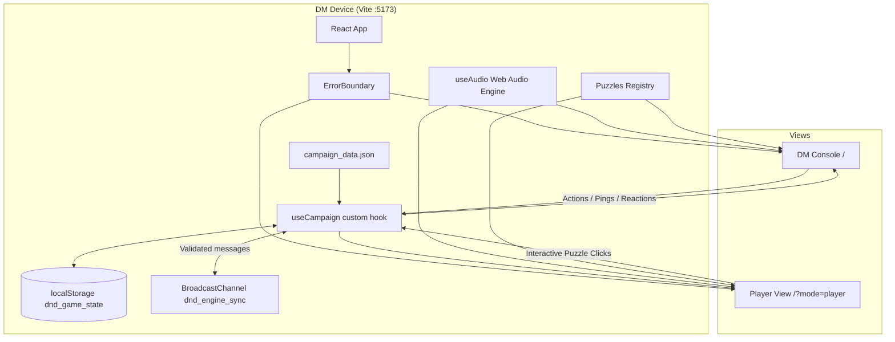
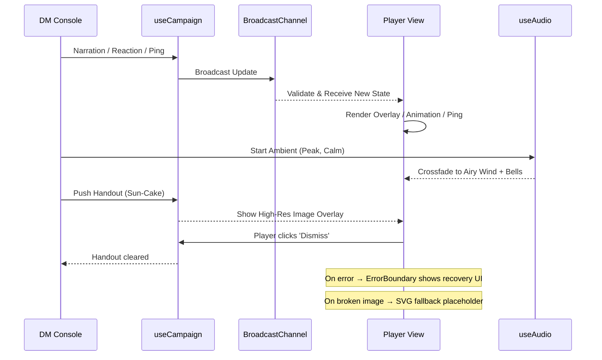

# D&D Engine Documentation (Developer Handoff)

## 🚀 Overview
The `dnd-engine` is a React-based Virtual Tabletop (VTT) specifically designed for a "Big Screen TV" experience. It uses a synchronized dual-view architecture where a **DM Console** controls a cinematic **Player View (TV)**.

---

## ✅ Feature Set (v2.0)

### 🎵 Minecraft-Style Audio Engine
- **Approach:** Procedural additive synthesis using Web Audio API (wrapped in try-catch for unsupported browsers).
- **Vibe:** Minimalist, melodic, and atmospheric.
- **12 Scene Profiles:** bakery (warm C Maj9), market (bright D Maj), woods (Lydian shimmer), glade (sparkly A Maj), stream (flowing Eb Maj7), goblin\_camp (tense D min), caves (crystalline B Phrygian), bridge (windy F# min), camp (lullaby Bb Maj9), ruins (mysterious E Dorian), peak (singing wind G Maj), celebration (festive C Maj).
- **Dynamic Moods:** `calm`, `tense`, and `combat` variations per scene.
- **Global Sync:** Audio state (playing/mood/volume) is synchronized across all views.
- **Clean Teardown:** Oscillators and audio nodes are properly stopped and disconnected on scene switch to prevent CPU leaks.

### 🎭 Interaction & Narrative Tools
- **Reaction Bar:** DM can trigger floating emoji reactions (🎉, ❤️, 🌟, ❓, 💀, 🔥, 👏, 😂) that appear on the TV.
- **Ping System:** Click-to-ping functionality on the DM "Scene Context" parchment sends a pulsing golden ring to the TV coordinates.
- **Digital Handouts:** Gallery of quest items (Sun-Cakes, Dragon Scale, Medal, Mrs. Crumb) that can be "pushed" to the TV as high-res overlays.
- **Custom Portraits:** DM can change hero portraits on the fly using a curated gallery (8 options); updates are synced globally.
- **Heroic Actions:** Dedicated "Help" (Advantage log) and "Snack" (+2 HP) buttons to reinforce the campaign's "kind-hearted" tone.
- **10 Interactive Puzzles:** Scene-specific puzzles including spotlight search, riddles, stepping stones, Simon Says melody, memory match, star constellation, treasure sorting, firefly catching, sneak path, and ingredient hunt. Sneak Path and Dragon's Hoard DM panels include a Reset button for mid-puzzle restarts.

### 🧭 DM Console UX
- **Chapter-Grouped Scenes:** The scene sidebar organizes all 12 scenes under chapter headers (Ch 1 · Oakhaven Village, Ch 2 · The Sparkle Woods, etc.) for quick navigation.
- **Quest Log Split:** Main quests (gold border, ⭐ prefix) are always visible; side quests are collapsible with a count badge.
- **Full Initiative Display:** The initiative tracker shows the complete turn order with the active character highlighted, not just a single "current turn" indicator.
- **Empty-State Guidance:** Scenes with no monsters or no puzzle display friendly helper messages instead of blank space.
- **TV-Optimized Narration:** Player View narration subtitles use larger text (text-4xl) for readability on big screens.
- **Touch-Friendly Puzzles:** Star Connect puzzle buttons are enlarged for easier interaction on touch devices and TVs.

### 🛡️ Stability & Resilience
- **Error Boundary:** Kid-friendly crash recovery screen ("The Dragon Sneezed!") with one-click restart. Prevents blank screens on component errors.
- **Image Fallbacks:** All external images (Unsplash, DiceBear) have `onError` handlers that swap in SVG placeholders for offline or broken-URL scenarios.
- **Validated Sync:** BroadcastChannel messages are type-checked before being applied to state, preventing corruption from malformed data.
- **Particle Budgeting:** Scene particle animations run for ~2 minutes instead of infinitely, reducing CPU/battery drain on older devices.

---

## 🌐 Technical Architecture

### State Sync Detail
The `useCampaign` hook acts as a local state manager that mirrors all changes to `localStorage` and broadcasts them via `BroadcastChannel`. Incoming messages are validated (`typeof === 'object'` guard) before being applied to state. Monsters are dynamically filtered by their `sceneId` field to match `currentSceneId`, so only scene-relevant monsters appear in the initiative tracker and on the Player View. This allows the DM Console and the TV View to stay in perfect sync without a backend server, provided they are running in the same browser context (or same origin on the same device).

Puzzle rendering on the Player View is scoped to the current scene — if the DM switches scenes while a puzzle is active, the puzzle overlay hides automatically (state is preserved if they switch back).

---

## 🎛️ DM-to-Player Experience Flow

---

## 🧪 Playtest Strategy
We use **Playwright** to run a "full-party simulation" and stability testing.

### Test Suites
| File | Purpose |
|------|---------|
| `playtest_campaign.spec.js` | Full campaign simulation: AI-like DM logic across all 3 acts, puzzle testing, HP sync, reactions, scene transitions. Captures final screenshots. |
| `ui_gameplay_test.spec.js` | Exhaustive UI/gameplay assertions: critical hits, HP bars, localStorage persistence, overlay timing. |
| `extra_edge_cases.spec.js` | Stability stress tests: rapid button spam (20x Next Turn, 10x Sneak Attack), long narration (500 chars), HP boundary clamping, puzzle bounds checking. |
| `visual_documentation.spec.js` | Screenshot-based visual regression (saves to `screenshots/`). |
| `simulate_campaign.spec.js` | DM→Player sync and scene transitions. |

---

## 🗂️ Critical Files
- **State Logic:** `dnd-engine/src/useCampaign.js` — All game state, BroadcastChannel sync, HP clamping, roll logic
- **Audio Engine:** `dnd-engine/src/useAudio.js` — Procedural synthesis, ambient pads, SFX, try-catch AudioContext guard
- **Visual Effects:** `dnd-engine/src/SceneEffects.jsx` — Particles (CPU-budgeted), Pings, Handouts (with image fallback), Reactions, Dice animation
- **UI Components:** `dnd-engine/src/App.jsx` — DM Console, Player View, ErrorBoundary, Portrait Gallery (with image fallbacks)
- **Puzzle Definitions:** `dnd-engine/src/Puzzles.jsx` — 10 interactive puzzles: Spotlight, Riddle, Stepping Stones, Ingredient Hunt, Firefly Catch, Sneak Path, Crystal Melody, Rune Match, Star Connect, Dragon's Hoard (scene-scoped rendering)
- **Campaign Data:** `dnd-engine/src/campaign_data.json` — 3 characters, 12 scenes (with `chapter` field for sidebar grouping), 10 monsters (with `sceneId` field), 17 quests (with `type` field). Swap file for new campaigns.

### Known Limitations (v2.0)
- **AC / Initiative** values from character sheets are not enforced by the engine (reference only).
- **Second Wind** (Thorne) and **Lay on Hands** (Valerius) are tabletop-only abilities — DM tracks manually via ±HP input.
- **Advantage** from Help action is logged but not mechanically enforced on the next roll.
- **External images** (Unsplash, DiceBear) require internet; SVG placeholders shown when offline.
- **BroadcastChannel** requires same-origin — true multi-device sync would need WebSocket/server.
- **Campaign content** (12 scenes, 10 monsters, 17 quests) is data-driven via `campaign_data.json` — swap the file for a different adventure.
