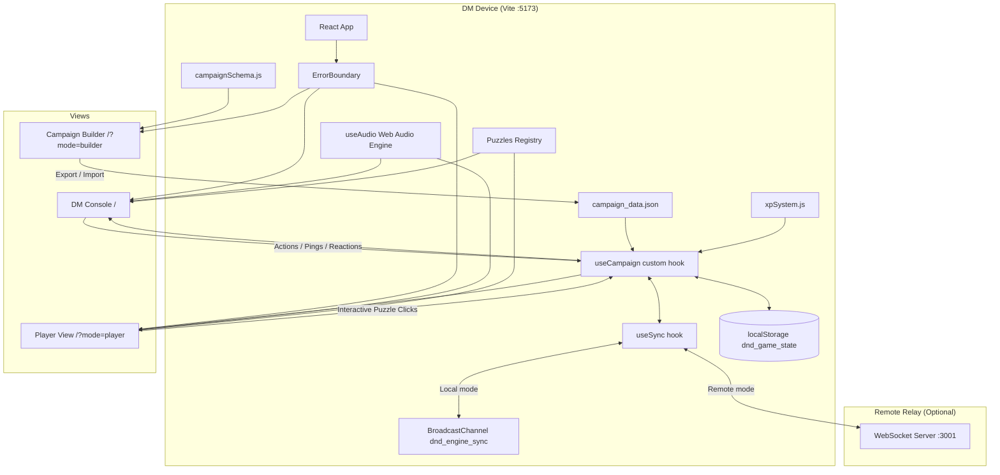
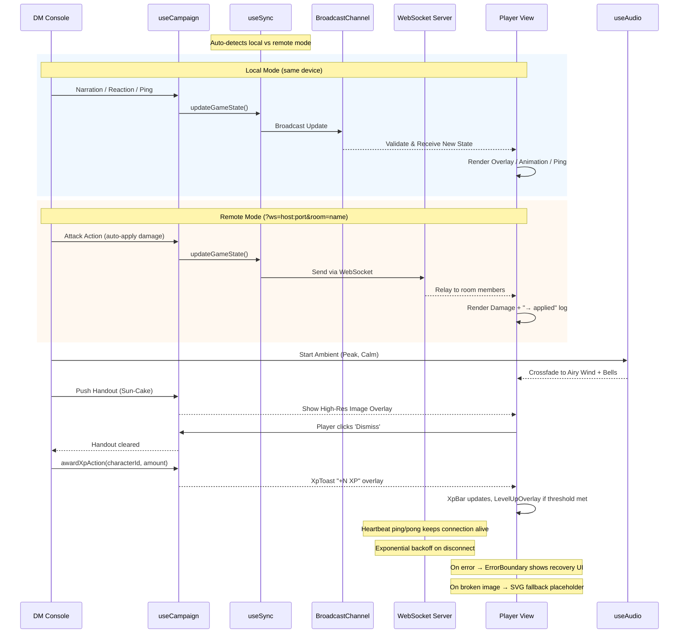

# D&D Engine Documentation (Developer Handoff)

## 🚀 Overview
The `dnd-engine` is a React-based Virtual Tabletop (VTT) specifically designed for a "Big Screen TV" experience. It uses a synchronized dual-view architecture where a **DM Console** controls a cinematic **Player View (TV)**. As of v3.0, the engine also supports **remote multiplayer** via WebSocket relay, a **Campaign Builder** for custom adventures, and an **XP & Leveling** progression system.

---

## ✅ Feature Set (v2.0)

### 🎵 Minecraft-Style Audio Engine
- **Approach:** Procedural additive synthesis using Web Audio API (wrapped in try-catch for unsupported browsers).
- **Vibe:** Minimalist, melodic, and atmospheric.
- **12 Scene Profiles:** bakery (warm C Maj9), market (bright D Maj), woods (Lydian shimmer), glade (sparkly A Maj), stream (flowing Eb Maj7), goblin\_camp (tense D min), caves (crystalline B Phrygian), bridge (windy F# min), camp (lullaby Bb Maj9), ruins (mysterious E Dorian), peak (singing wind G Maj), celebration (festive C Maj).
- **Dynamic Moods:** `calm`, `tense`, and `combat` variations per scene.
- **Global Sync:** Audio state (playing/mood/volume) is synchronized across all views.
- **Clean Teardown:** Oscillators and audio nodes are properly stopped and disconnected on scene switch to prevent CPU leaks.

### 🎭 Interaction & Narrative Tools
- **Reaction Bar:** DM can trigger floating emoji reactions (🎉, ❤️, 🌟, ❓, 💀, 🔥, 👏, 😂) that appear on the TV.
- **Ping System:** Click-to-ping functionality on the DM "Scene Context" parchment sends a pulsing golden ring to the TV coordinates.
- **Digital Handouts:** Gallery of quest items (Sun-Cakes, Dragon Scale, Medal, Mrs. Crumb) that can be "pushed" to the TV as high-res overlays.
- **Custom Portraits:** DM can change hero portraits on the fly using a curated gallery (8 options); updates are synced globally.
- **Heroic Actions:** Dedicated "Help" (Advantage log) and "Snack" (+2 HP) buttons to reinforce the campaign's "kind-hearted" tone.
- **10 Interactive Puzzles:** Scene-specific puzzles including spotlight search, riddles, stepping stones, Simon Says melody, memory match, star constellation, treasure sorting, firefly catching, sneak path, and ingredient hunt. Sneak Path and Dragon's Hoard DM panels include a Reset button for mid-puzzle restarts.

### 🧭 DM Console UX
- **Chapter-Grouped Scenes:** The scene sidebar organizes all 12 scenes under chapter headers (Ch 1 · Oakhaven Village, Ch 2 · The Sparkle Woods, etc.) for quick navigation.
- **Quest Log Split:** Main quests (gold border, ⭐ prefix) are always visible; side quests are collapsible with a count badge.
- **Full Initiative Display:** The initiative tracker shows the complete turn order with the active character highlighted, not just a single "current turn" indicator.
- **Empty-State Guidance:** Scenes with no monsters or no puzzle display friendly helper messages instead of blank space.
- **TV-Optimized Narration:** Player View narration subtitles use larger text (text-4xl) for readability on big screens.
- **Touch-Friendly Puzzles:** Star Connect puzzle buttons are enlarged for easier interaction on touch devices and TVs.

### 🛡️ Stability & Resilience
- **Error Boundary:** Kid-friendly crash recovery screen ("The Dragon Sneezed!") with one-click restart. Prevents blank screens on component errors.
- **Image Fallbacks:** All external images (Unsplash, DiceBear) have `onError` handlers that swap in SVG placeholders for offline or broken-URL scenarios.
- **Validated Sync:** BroadcastChannel messages are type-checked before being applied to state, preventing corruption from malformed data.
- **Particle Budgeting:** Scene particle animations run for ~2 minutes instead of infinitely, reducing CPU/battery drain on older devices.

---

## ✅ Feature Set (v3.0)

### ⚔️ Combat Improvements
- **Auto-apply Damage:** When a character or monster uses an attack action, damage is automatically applied to the target (first alive monster for heroes, active character for monsters). The combat log shows "→ applied" entries, removing the need for manual HP adjustments during combat.
- **Advantage Mechanic:** Help action now grants real mechanical Advantage — rolls 2d20 and takes the highest. Tracked via `hasAdvantage` state in `useCampaign`, cleared after the advantaged roll. Shows "★ ADV" in the combat log and a "✨ ADVANTAGE!" overlay on the Player View.
- **Dead Monster Removal:** Monsters at 0 HP receive grayscale styling and a collapsed card, and are automatically skipped in initiative. A "Revive" button appears on dead monster cards to restore them. The initiative tracker shows strikethrough for dead monsters.

### ⌨️ DM Quality-of-Life
- **Keyboard Shortcuts:** DM can press `N` for next turn, `D` or `Esc` to dismiss overlays, `1`–`3` to select heroes. A hint bar displays available shortcuts in the header.
- **Narration Auto-dismiss:** Duration buttons (10s, 30s, ∞) on the narration panel. A `NarrationAutoDismiss` component handles the countdown timer and auto-clears narration when it expires.
- **Per-scene Narration Presets:** Each of the 12 scenes now has an `introNarration` field in `campaign_data.json`. A "📜 Scene Intro" button in the narration panel populates the text box with the scene's intro narration for quick broadcast.
- **DM Scene Prep Panel:** Auto-shows when switching scenes, auto-collapses after 10 seconds. Displays NPCs, tactical tips, quest hints, and a DM tip for each scene. Data is stored in the `dmNotes` field of each scene in `campaign_data.json`.
- **Auto-combat Mood:** When an attack with damage occurs, the audio mood auto-switches to `combat`. After 30 seconds of combat inactivity, fades to `tense`, then 15 seconds later to `calm`. Uses `lastCombatAction` timestamp in game state.

### 🏗️ Campaign Builder
- **Campaign Builder UI:** Full campaign editor accessible at `/?mode=builder`. Features 5 tabs: Overview, Characters, Scenes, Monsters, and Quests. Supports inline editing, action sub-lists with damage validation, JSON preview/export/import, and D&D theme styling. Uses `src/campaignSchema.js` for schema validation and entity factories.

### 🌐 WebSocket Remote Play
- **Remote Multiplayer:** A `server/` directory contains a Node.js WebSocket relay server (`ws` package) with room-based multiplayer, full state sync, heartbeat ping/pong, and client count tracking.
- **Unified Sync Hook:** The new `src/useSync.js` hook abstracts state synchronization — auto-detects local (BroadcastChannel) vs remote (`?ws=host:port&room=name` URL params) mode. Remote mode uses exponential backoff for reconnection.
- **Connection Status:** A connection indicator shows in the DM sidebar when in remote mode, displaying connected client count.

### ⭐ XP & Leveling System
- **XP Progression:** Pure functions in `src/xpSystem.js` with XP thresholds (0 / 100 / 250 / 500 / 800 for levels 1–5) and per-character level bonuses (HP increase, attack bonus, new abilities). XP reward constants for combat, quests, and roleplay.
- **UI Components in `src/LevelUpOverlay.jsx`:**
  - **XpBar** — Shown on character cards, displays current XP progress toward next level.
  - **DmXpPanel** — Sidebar panel with quick-award buttons for common XP amounts.
  - **LevelUpOverlay** — Cinematic full-screen celebration when a character levels up.
  - **XpToast** — Floating "+N XP" notification on the Player View.
- **Automatic HP Bonus:** When a character levels up, their max HP is automatically increased based on per-character level bonus tables.

---

## 🌐 Technical Architecture

### State Sync Detail
The `useCampaign` hook acts as a local state manager that mirrors all changes to `localStorage` and synchronizes them via the `useSync` hook. The sync layer auto-detects the transport mode:

- **Local mode (default):** Uses `BroadcastChannel` for same-origin, same-device sync between the DM Console and Player View tabs. Messages are validated (`typeof === 'object'` guard) before being applied to state.
- **Remote mode:** Activated via `?ws=host:port&room=name` URL params. Connects to the WebSocket relay server with room-based isolation, exponential backoff reconnection, and heartbeat keep-alive. Enables true multi-device play across LAN or Tailscale.

Monsters are dynamically filtered by their `sceneId` field to match `currentSceneId`, so only scene-relevant monsters appear in the initiative tracker and on the Player View. The `defaultState` now also includes `characterXp`, `levelUp`, `xpGain`, `hasAdvantage`, and `lastCombatAction` fields.

Puzzle rendering on the Player View is scoped to the current scene — if the DM switches scenes while a puzzle is active, the puzzle overlay hides automatically (state is preserved if they switch back).

---

## 🎛️ DM-to-Player Experience Flow

---

## 🧪 Playtest Strategy
We use **Playwright** to run a "full-party simulation" and stability testing.

### Test Suites
| File | Purpose |
|------|---------|
| `playtest_campaign.spec.js` | Full campaign simulation: AI-like DM logic across all 3 acts, puzzle testing, HP sync, reactions, scene transitions. Captures final screenshots. |
| `ui_gameplay_test.spec.js` | Exhaustive UI/gameplay assertions: critical hits, HP bars, localStorage persistence, overlay timing. |
| `extra_edge_cases.spec.js` | Stability stress tests: rapid button spam (20x Next Turn, 10x Sneak Attack), long narration (500 chars), HP boundary clamping, puzzle bounds checking. |
| `visual_documentation.spec.js` | Screenshot-based visual regression (saves to `screenshots/`). |
| `simulate_campaign.spec.js` | DM→Player sync and scene transitions. |

---

## 🗂️ Critical Files
- **State Logic:** `dnd-engine/src/useCampaign.js` — All game state, sync integration, HP clamping, roll logic, auto-apply damage, advantage mechanic, XP awarding. Exports `sync` object and `awardXpAction`.
- **Sync Layer:** `dnd-engine/src/useSync.js` — BroadcastChannel + WebSocket sync abstraction hook. Auto-detects local vs remote mode via URL params (`?ws=host:port&room=name`). Handles exponential backoff reconnection.
- **Audio Engine:** `dnd-engine/src/useAudio.js` — Procedural synthesis, ambient pads, SFX, try-catch AudioContext guard, auto-combat mood switching via `lastCombatAction` timestamp.
- **Visual Effects:** `dnd-engine/src/SceneEffects.jsx` — Particles (CPU-budgeted), Pings, Handouts (with image fallback), Reactions, Dice animation
- **UI Components:** `dnd-engine/src/App.jsx` — DM Console, Player View, Campaign Builder routing, ErrorBoundary, Portrait Gallery (with image fallbacks). Supports 3 modes: `/` (DM), `/?mode=player` (TV), `/?mode=builder` (Campaign Editor).
- **Puzzle Definitions:** `dnd-engine/src/Puzzles.jsx` — 10 interactive puzzles: Spotlight, Riddle, Stepping Stones, Ingredient Hunt, Firefly Catch, Sneak Path, Crystal Melody, Rune Match, Star Connect, Dragon's Hoard (scene-scoped rendering)
- **XP & Leveling:** `dnd-engine/src/xpSystem.js` — XP thresholds (levels 1–5), per-character level bonuses (HP, attack, abilities), XP reward constants, pure calculation functions.
- **Level-Up UI:** `dnd-engine/src/LevelUpOverlay.jsx` — XpBar (character cards), DmXpPanel (sidebar), LevelUpOverlay (cinematic celebration), XpToast (floating notification).
- **Campaign Builder:** `dnd-engine/src/CampaignBuilder.jsx` — Full campaign editor with 5 tabs (Overview, Characters, Scenes, Monsters, Quests), inline editing, JSON preview/export/import.
- **Campaign Schema:** `dnd-engine/src/campaignSchema.js` — Campaign validation, entity factories (characters, scenes, monsters, quests), import/export utilities.
- **WebSocket Server:** `dnd-engine/server/index.js` + `dnd-engine/server/package.json` — Node.js relay server using `ws` package. Room-based multiplayer, heartbeat ping/pong, client count tracking. Runs on port 3001.
- **Campaign Data:** `dnd-engine/src/campaign_data.json` — 3 characters, 12 scenes (with `chapter`, `introNarration`, and `dmNotes` fields), 10 monsters (with `sceneId` field), 17 quests (with `type` field). Swap file for new campaigns.

### Known Limitations (v3.0)
- **AC / Initiative** values from character sheets are not enforced by the engine (reference only).
- **Second Wind** (Thorne) and **Lay on Hands** (Valerius) are tabletop-only abilities — DM tracks manually via ±HP input.
- **External images** (Unsplash, DiceBear) require internet; SVG placeholders shown when offline.
- **WebSocket server** must be started separately with `cd dnd-engine/server && npm start` (port 3001). It is not bundled into the Vite dev server.
- **BroadcastChannel** still used for local same-origin sync; for true multi-device play, use the WebSocket server option with `?ws=host:port&room=name` URL params.
- **XP system** level bonuses are hardcoded for the 3 built-in heroes (lily, thorne, valerius). Custom characters from the Campaign Builder do not have level bonus tables.
- **Campaign content** (12 scenes, 10 monsters, 17 quests) is data-driven via `campaign_data.json` — swap the file or use the Campaign Builder for a different adventure.
