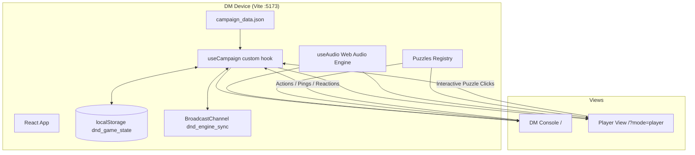
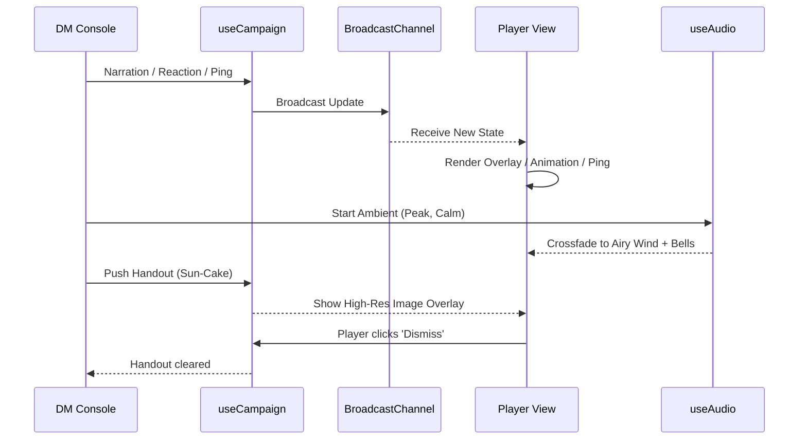

# D&D Engine Documentation (Developer Handoff)

## 🚀 Overview
The `dnd-engine` is a React-based Virtual Tabletop (VTT) specifically designed for a "Big Screen TV" experience. It uses a synchronized dual-view architecture where a **DM Console** controls a cinematic **Player View (TV)**.

---

## ✅ Feature Set (v2.0)

### 🎵 Minecraft-Style Audio Engine
- **Approach:** Procedural additive synthesis using Web Audio API.
- **Vibe:** Minimalist, melodic, and atmospheric.
- **Features:** 
    - **Bakery:** Warm major-9th pads.
    - **Woods:** Ethereal Lydian shimmer.
    - **Peak:** Airy singing wind + generative bell notes.
    - **Dynamic Moods:** `calm`, `tense`, and `combat` variations per scene.
    - **Global Sync:** Audio state (playing/mood/volume) is synchronized across all views.

### 🎭 Interaction & Narrative Tools
- **Reaction Bar:** DM can trigger floating emoji reactions (🎉, ❤️, 🌟, etc.) that appear on the TV.
- **Ping System:** Click-to-ping functionality on the DM "Scene Context" parchment sends a pulsing golden ring to the TV coordinates.
- **Digital Handouts:** Gallery of quest items (Sun-Cakes, Medals) that can be "pushed" to the TV as high-res overlays.
- **Custom Portraits:** DM can change hero portraits on the fly using a curated gallery; updates are synced globally.
- **Heroic Actions:** Dedicated "Help" (Advantage log) and "Snack" (+2 HP) buttons to reinforce the campaign's "kind-hearted" tone.

---

## 🌐 Technical Architecture

### State Sync Detail
The `useCampaign` hook acts as a local state manager that mirrors all changes to `localStorage` and broadcasts them via `BroadcastChannel`. This allows the DM Console and the TV View to stay in perfect sync without a backend server, provided they are running in the same browser context (or same origin on the same device).

---

## 🎛️ DM-to-Player Experience Flow

---

## 🧪 Playtest Strategy
We use **Playwright** to run a "full-party simulation." 
The `playtest_campaign.spec.js` script:
1.  Launches a DM and Player page.
2.  Assigns AI-like logic to simulate each act.
3.  Tests the **Spotlight Search**, **Riddle**, and **Stepping Stones** puzzles.
4.  Validates HP syncing, Reaction triggering, and Scene transitions.
5.  Captures final screenshots (`playtest_dm_final.png`, `playtest_player_final.png`).

---

## 🗂️ Critical Files
- **State Logic:** `dnd-engine/src/useCampaign.js`
- **Audio Engine:** `dnd-engine/src/useAudio.js`
- **Visual Effects:** `dnd-engine/src/SceneEffects.jsx` (Particles, Pings, Handouts, Reactions)
- **UI Components:** `dnd-engine/src/App.jsx`
- **Puzzle Definitions:** `dnd-engine/src/Puzzles.jsx`
