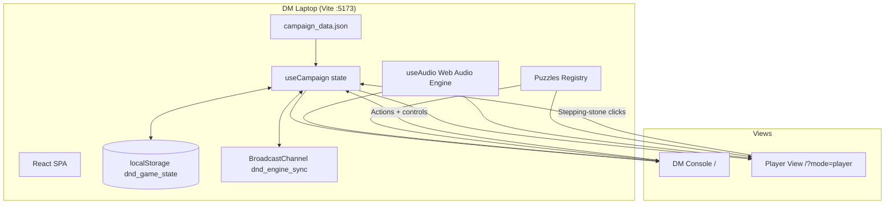
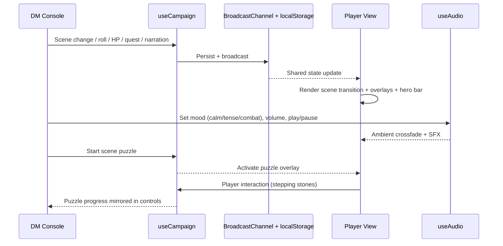
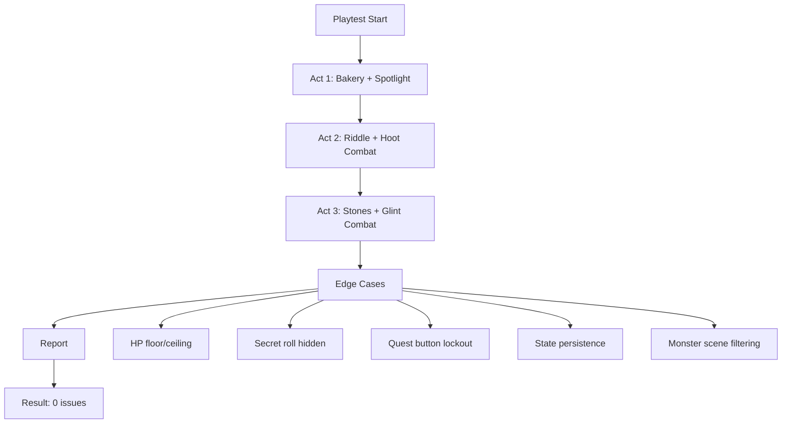

# D&D Engine Documentation (Updated)

## ✅ Current Build Status

- Core gameplay + DM tools complete
- Immersive audio/visual layer complete
- Interactive puzzle system complete (3 puzzles)
- Automated full-campaign playtest complete (**0 issues found**)

Recent validation:
- `npx playwright test` (15 existing tests): pass
- `npx playwright test playtest_campaign.spec.js`: pass
- `npx vite build`: pass

---

## 🌐 Runtime & Sync Architecture

---

## 🎛️ DM-to-Player Experience Flow

---

## 🧩 Campaign UX Journey (Kids-first)

```mermaid
flowchart LR
    A[Act 1: Bakery] --> A1[Spotlight Search Puzzle]
    A1 --> A2[Find clues + Quest toast]
    A2 --> B[Act 2: Sparkle Woods]
    B --> B1[Hoot Riddle: Typewriter + Hints]
    B1 --> B2[Combat vs Hoot]
    B2 --> C[Act 3: Whispering Peak]
    C --> C1[Stepping Stones Puzzle - Interactive]
    C1 --> C2[Boss fight vs Glint]
    C2 --> D[Final quest: Recover Sun-Cakes]
    D --> E[Celebration toast + narration]
```

---

## 🎮 User Experience Highlights

### Player View (TV)
- Cinematic scene transitions
- Ambient music per scene + mood switching
- Particle effects (bakery/woods/peak variants)
- Dice tumble animation + critical hit/fail moments
- Quest completion toasts
- DM narration subtitles
- Interactive puzzle overlays (especially stepping stones)

### DM Console
- Fast scene switching and turn control
- Character + monster cards with HP controls and custom HP delta
- Skill check + secret roll tools
- Combat log with roll history
- Audio control panel (play/pause, mood, volume)
- Scene-specific puzzle launcher + live puzzle management

---

## 🧪 Playtest Coverage & Outcome

The automated multi-agent campaign playtest (`playtest_campaign.spec.js`) simulates:
- DM orchestration across all three acts
- Lily/Thorne/Valerius action flow
- All three puzzles end-to-end
- Quest completion flow
- Combat + HP sync behavior
- Overlay visibility
- Persistence after page refresh

---

## 🗂️ Source of Truth Files

- Game UI: `dnd-engine/src/App.jsx`
- State engine: `dnd-engine/src/useCampaign.js`
- Audio engine: `dnd-engine/src/useAudio.js`
- Puzzle system: `dnd-engine/src/Puzzles.jsx`
- Campaign data: `dnd-engine/src/campaign_data.json`
- Full playtest: `dnd-engine/playtest_campaign.spec.js`
