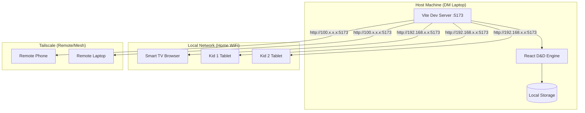
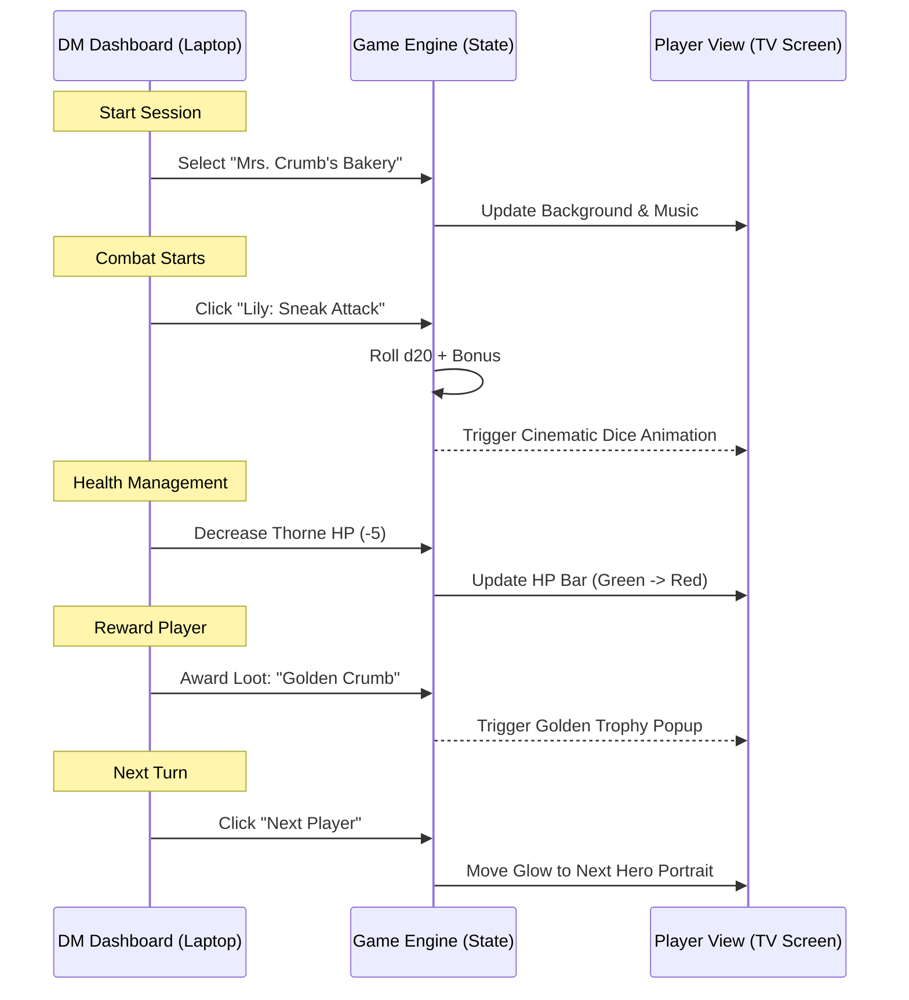
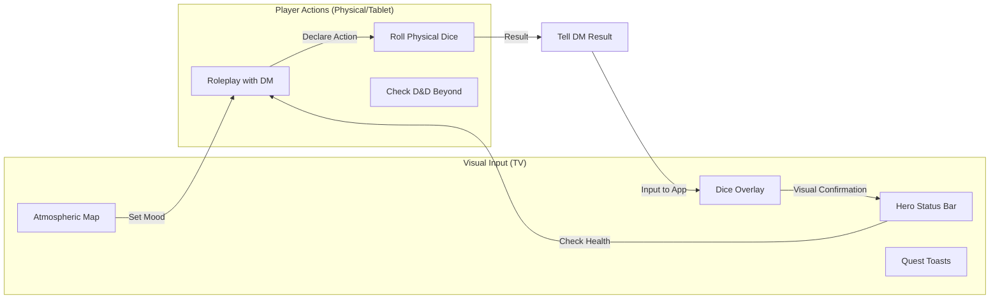
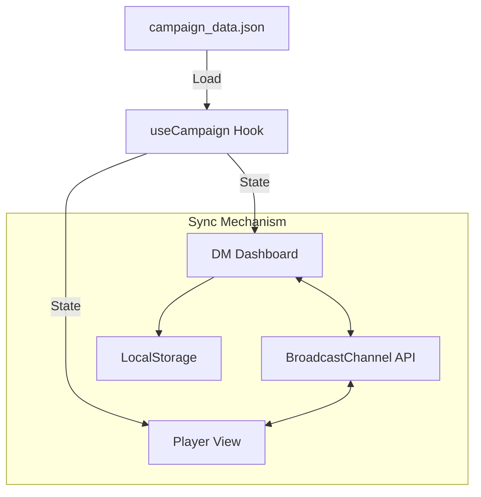

# Infrastructure & User Journey: D&D Engine

## 🌐 Network Infrastructure

Your D&D Engine is configured for **Local Network & Tailscale** access. By using the `host: true` setting in Vite, the server listens on all network interfaces.

---

## 🎭 User Journey: The DM Workflow

This chart outlines how you manage the game session from the DM Dashboard.

---

## 🎲 User Journey: The Player Experience

This chart outlines what the kids see and how they interact with the world you've built.

---

## 🛠️ Data-Driven Engine Architecture

How the app remains reusable for future campaigns.

